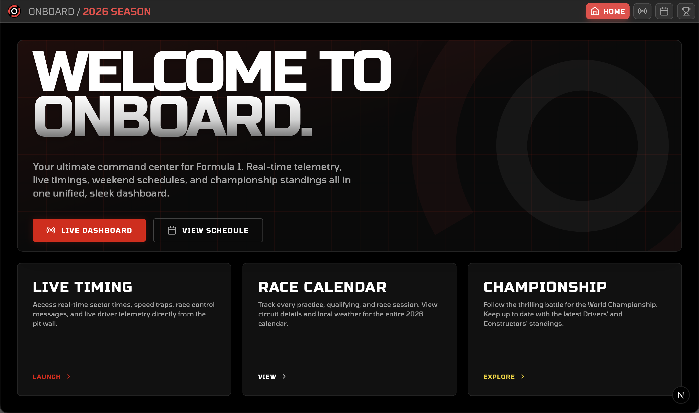
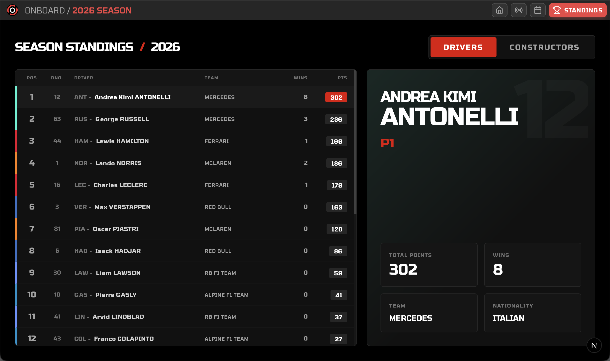

## Overview

**ONBOARD** is a sleek, ultra-modern F1 telemetry and scheduling dashboard. Designed with an industry-grade glassmorphic UI, it hooks directly into official Formula 1 live data streams to deliver real-time race timing without needing to refresh the page.

### Features

- **Live Telemetry:** Streams live lap times, sectors, and track status instantly using Server-Sent Events (SSE).
- **Championship Standings:** Dynamic 60/40 dashboard featuring driver and constructor standings with interactive typographic details and official F1 team colors.
- **Dynamic Calendar:** Automatically fetches the 2026 Racing Calendar using the OpenF1 API, complete with track maps and session timings automatically converted to your local timezone.
- **Unified Design Language:** Built with a dark-mode frosted-glass aesthetic, official F1 typography, and high-performance components.
- **Polyglot Monorepo:** Structured as an industry-standard monorepo with a Next.js (TypeScript) frontend communicating with a FastAPI (Python) backend orchestrator.

## Previews

### Live Race Dashboard
Watch the telemetry roll in live. The dashboard displays lap counts, individual sector times, and real-time tire strategies.

### Race Schedule & Calendar
Keep track of upcoming sessions with a beautiful, automatically updating schedule featuring full-color track maps and countdown timers.

### Championship Standings
A beautifully crafted 60/40 interactive dashboard to explore the current Driver and Constructor championship standings.

