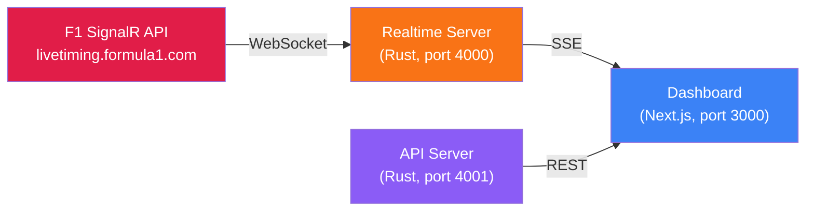
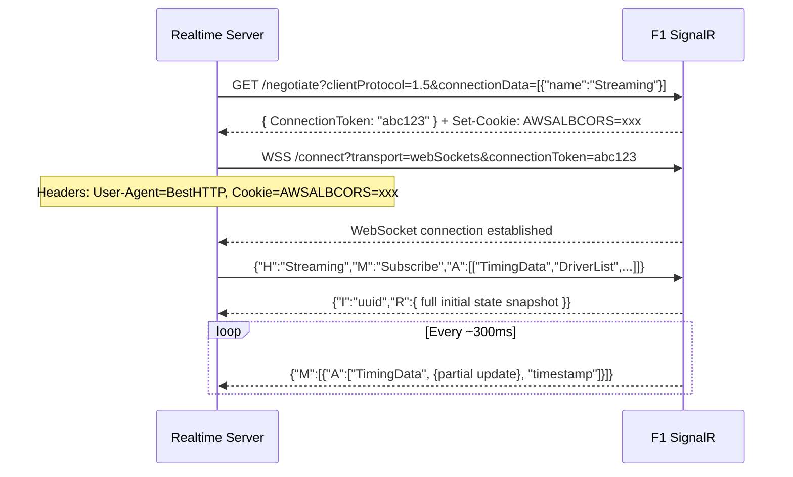
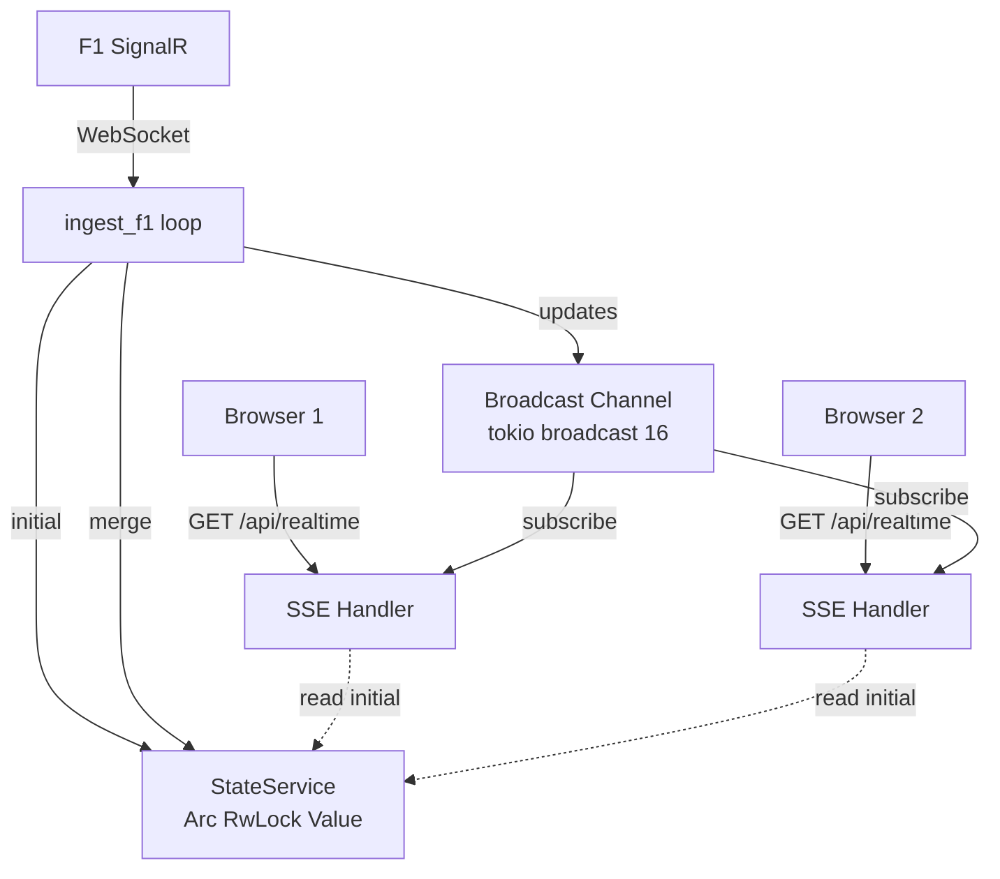
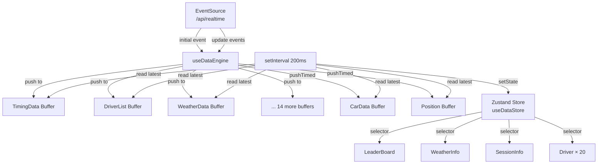

# f1-dash: Complete Architecture Deep Dive

## Overview

f1-dash is a real-time F1 timing dashboard. It has **3 services**:



---

## Part 1: The SignalR Connection (`signalr/src/lib.rs`)

### How F1 exposes live data

Formula 1 runs a **SignalR** hub at `livetiming.formula1.com/signalr`. SignalR is Microsoft's real-time protocol — it negotiates via HTTP, then upgrades to **WebSocket** for streaming.

### Connection flow



### Key details:
1. **Negotiate** — GET request to `/negotiate` returns a `ConnectionToken` and a cookie (`AWSALBCORS`)
2. **Connect** — WebSocket to `/connect` with the token. Must send `BestHTTP` as User-Agent (mimics the official F1 app)
3. **Subscribe** — Send a `Subscribe` invoke with 17 topic names
4. **Initial response** — F1 returns the FULL current state as one big JSON blob
5. **Updates** — F1 pushes incremental updates per-topic. Each message contains: `[topic_name, partial_data, timestamp]`

### The 17 F1 Topics

| Topic | What it contains |
|---|---|
| `TimingData` | Position, gaps, sectors, speeds, lap times for every driver |
| `DriverList` | Driver names, team colors, racing numbers |
| `SessionInfo` | GP name, session type (Race/Quali/FP), start/end dates |
| `SessionStatus` | `"Started"`, `"Finished"`, `"Finalised"`, `"Ends"` |
| `SessionData` | StatusSeries (historical status changes), Lap series |
| `LapCount` | `{ CurrentLap: 18, TotalLaps: 57 }` |
| `WeatherData` | Air temp, track temp, humidity, wind, rainfall |
| `TrackStatus` | `{ Status: "1", Message: "AllClear" }` / Yellow/Red flags |
| `TimingAppData` | Tyre stints (compound, laps, new/used), grid positions |
| `TimingStats` | Personal best lap times, best sector times per driver |
| `RaceControlMessages` | Flags, penalties, track limits, DRS enabled/disabled |
| `TeamRadio` | Audio capture URLs for team radio messages |
| `CarData.z` | Compressed: RPM, speed, gear, throttle, brake, DRS per car |
| `Position.z` | Compressed: X/Y/Z track position per car (for map) |
| `ExtrapolatedClock` | Session clock with extrapolation |
| `Heartbeat` | Keep-alive pulse |
| `TopThree` | Top 3 drivers summary |
| `ChampionshipPrediction` | Live championship points prediction |

> [!IMPORTANT]
> `CarData.z` and `Position.z` are **zlib-compressed + base64-encoded**. They must be decoded with `pako.inflateRaw()` on the frontend.

---

## Part 2: Realtime Server (`realtime/src/`)

The Rust backend is beautifully simple — ~150 lines total.

### Architecture



### `main.rs` — Entry point
```rust
// 1. Create shared state service (thread-safe JSON value)
let state_service = StateService::new();

// 2. Create broadcast channel (16-message buffer)
let (sender, _) = broadcast::channel::<String>(16);

// 3. Spawn F1 ingestion loop (reconnects on failure)
tokio::spawn(async move {
    loop {
        match f1::ingest_f1(state_service.clone(), sender.clone()).await { ... }
        // If session changes or connection drops, wait 2s and restart
        tokio::time::sleep(Duration::from_secs(2)).await;
    }
});

// 4. Start HTTP server
http_server::start(state_service, sender).await?;
```

### `f1.rs` — F1 data ingestion
```rust
pub async fn ingest_f1(state_service, update_sender) {
    // Connect to F1 via SignalR
    let mut client = signalr::create_client(URL, HUB).await?;
    
    // Subscribe to all 17 topics — returns FULL initial state
    let initial = signalr::subscribe(&mut client, &TOPICS).await?;
    state_service.set_state(initial).await?;  // Store complete state
    
    // Listen for incremental updates
    let mut stream = signalr::listen(client);
    while let Some(items) = stream.next().await {
        for update in items {
            // If SessionInfo changes (new session), restart connection
            if update.topic == "SessionInfo" && update.data.has("/Name") {
                return Ok(());  // Will reconnect in the loop
            }
            
            // Broadcast update to all SSE clients
            let json = json!({ update.topic: update.data });
            sender.send(json.to_string());
            
            // Merge into state (for new clients joining later)
            state_service.update_state(json).await?;
        }
    }
}
```

### `state_service.rs` — Deep merge logic

```rust
pub fn merge(base: &mut Value, update: Value) {
    match (base, update) {
        // Object + Object → recursive merge
        (Object(prev), Object(update)) => {
            for (k, v) in update {
                merge(prev.entry(k).or_insert(Null), v);
            }
        }
        // Array + Object → index-based update (F1 sends array patches as {"0": ..., "2": ...})
        (Array(prev), Object(update)) => {
            for (k, v) in update {
                if let Ok(index) = k.parse::<usize>() {
                    merge(&mut prev[index], v);
                }
            }
        }
        // Everything else → replace
        (a, b) => *a = b,
    }
}
```

> [!NOTE]
> This merge is critical. F1 sends **partial updates** like `{"TimingData": {"Lines": {"1": {"LastLapTime": {"Value": "1:23.456"}}}}}`. The merge ensures only the changed nested values are updated while preserving everything else.

### `realtime.rs` — SSE endpoint

```rust
pub async fn sse_stream(State(ctx)) -> Sse<impl Stream> {
    // 1. Get current full state for this new client
    let initial_state = ctx.state_service.get_state_string().await;
    
    // 2. Subscribe to broadcast channel for future updates
    let rx = ctx.tx.subscribe();
    
    // 3. Stream: first send "initial" event, then "update" events
    let initial = stream::once(async {
        Ok(Event::default().event("initial").data(initial_state))
    });
    
    let updates = BroadcastStream::new(rx)
        .map(|data| Event::default().event("update").data(data))
        .map(Ok);
    
    Sse::new(initial.chain(updates)).keep_alive(KeepAlive::new())
}
```

This is elegant:
- **New client** → immediately gets full state via `"initial"` event
- **Then** → gets every subsequent update via `"update"` events
- **No polling** — updates are pushed the instant F1 sends them

---

## Part 3: Dashboard Frontend (`dashboard/src/`)

### Data flow



### Step-by-step:

#### 1. `useSocket.ts` — Connect to SSE

```typescript
const sse = new EventSource(`${LIVE_URL}/api/realtime`);

sse.addEventListener("initial", (message) => {
    handleInitial(JSON.parse(message.data));
});

sse.addEventListener("update", (message) => {
    handleUpdate(JSON.parse(message.data));
});
```

Simple EventSource — listens for `initial` and `update` events.

#### 2. `useDataEngine.ts` — The brain

The data engine maintains **16 separate buffers** (one per F1 topic) plus 2 for compressed data:

```typescript
const buffers = {
    TimingData: useStatefulBuffer(),      // Merges updates into full state
    DriverList: useStatefulBuffer(),
    WeatherData: useStatefulBuffer(),
    SessionStatus: useStatefulBuffer(),
    // ... 11 more
};

const carBuffer = useBuffer<CarsData>();   // Raw frames (timestamped)
const posBuffer = useBuffer<Positions>();  // Raw frames (timestamped)
```

**On initial:** Push full state to each buffer
**On update:** Push the partial update for the relevant topic

**Every 200ms** (via `setInterval`):
```typescript
const handleCurrentState = () => {
    const newStateFrame = {};
    
    // Read latest merged value from each buffer
    Object.keys(buffers).forEach((key) => {
        const latest = buffers[key].latest();
        if (latest) newStateFrame[key] = latest;
    });
    
    // Push to Zustand store → triggers re-renders
    updateState(newStateFrame);
    
    // Also update car telemetry and positions
    const carFrame = carBuffer.latest();
    if (carFrame) updateCarData(carFrame);
};
```

> [!TIP]
> **Why 200ms intervals instead of immediate updates?**
> F1 sends updates every ~100-300ms. Rendering every single one would cause excessive re-renders. The 200ms interval acts as a **frame rate limiter** — it batches updates and renders at ~5fps, which is smooth enough for a timing screen but doesn't kill performance.

#### 3. `useStatefulBuffer` — Stateful merge + time buffer

```typescript
const push = (update) => {
    // Merge partial update into current full state
    currentRef.current = merge(currentRef.current ?? {}, update);
    // Push the merged snapshot to the time buffer
    buffer.push(currentRef.current);
};
```

This is key: it **accumulates** partial updates. If F1 sends:
1. `{ Lines: { "1": { Position: "1" } } }`
2. `{ Lines: { "1": { LastLapTime: { Value: "1:23.456" } } } }`

After both pushes, `currentRef` contains:
```json
{ "Lines": { "1": { "Position": "1", "LastLapTime": { "Value": "1:23.456" } } } }
```

#### 4. `useDataStore` (Zustand) — Global state

```typescript
const useDataStore = create((set) => ({
    state: null,      // All F1 topic data
    carsData: null,   // Decompressed car telemetry
    positions: null,  // Decompressed positions
    
    setState: (partialState) => set((prev) => ({
        state: { ...(prev.state ?? {}), ...partialState }
    })),
}));
```

Components use **selectors** to subscribe to only the data they need:
```typescript
// Only re-renders when DriverList changes
const drivers = useDataStore(({ state }) => state?.DriverList);

// Only re-renders when TimingData changes
const timing = useDataStore(({ state }) => state?.TimingData);
```

#### 5. Components — Rendering

**LeaderBoard** sorts drivers by position and renders each:
```typescript
Object.values(driversTiming.Lines)
    .sort(sortPos)  // Sort by Position field
    .map((timingDriver) => (
        <Driver driver={drivers[timingDriver.RacingNumber]} timingDriver={timingDriver} />
    ))
```

**Driver** renders a grid row with sub-components:
```
| DriverTag | DriverDRS | DriverTire | DriverInfo | DriverGap | DriverLapTime | DriverMiniSectors | DriverCarMetrics |
```

Each sub-component reads from the Zustand store directly:
- `DriverGap` reads `IntervalToPositionAhead.Value` and `GapToLeader`
- `DriverTire` reads `TimingAppData.Lines[number].Stints` (last stint = current tyre)
- `DriverMiniSectors` reads `Sectors[0,1,2].Segments[].Status` for color-coded mini sectors
- `DriverDRS` reads `CarData.Channels["45"]` (DRS telemetry value > 9 = open)

---

## Part 4: The Merge Algorithm (Most Critical Part)

F1's API sends **incremental patches**, not full state. Understanding the merge is essential:

### Example: Lap time update

F1 sends this update:
```json
{
    "TimingData": {
        "Lines": {
            "1": {
                "LastLapTime": {
                    "Value": "1:23.456",
                    "Status": 2049,
                    "OverallFastest": false,
                    "PersonalFastest": true
                }
            }
        }
    }
}
```

This gets merged into the existing state. Only `Lines.1.LastLapTime` changes — everything else (Position, Sectors, GapToLeader, etc.) is preserved.

### Example: Mini sector update

As a driver crosses each mini sector:
```json
{ "TimingData": { "Lines": { "1": { "Sectors": { "0": { "Segments": { "3": { "Status": 2049 } } } } } } } }
```

Note how `Sectors` and `Segments` are sent as **objects with numeric keys** (`"0"`, `"3"`), not arrays. The merge function handles this:
```typescript
// Array + Object → index-based update
if (Array.isArray(base) && isObject(update)) {
    const result = [...base];
    for (const [key, value] of Object.entries(update)) {
        const index = parseInt(key);
        result.splice(index, 1, merge(result[index], value));
    }
    return [...result];
}
```

---

## Part 5: Compressed Data (CarData.z / Position.z)

These are too large to send as JSON, so F1 compresses them:

1. F1 serializes to JSON
2. Compresses with **zlib raw deflate**
3. Encodes as **base64**
4. Sends as a string in the `CarDataZ` / `PositionZ` fields

Frontend decompresses:
```typescript
import { inflateRaw } from "pako";

const inflate = <T>(data: string): T => {
    const binaryString = atob(data);           // base64 → binary
    const bytes = new Uint8Array(len);          // binary → bytes
    const inflatedData = inflateRaw(bytes, { to: "string" }); // decompress
    return JSON.parse(inflatedData);            // parse JSON
};
```

**CarData** contains per-car telemetry:
```json
{
    "Entries": [{
        "Utc": "2024-05-05T19:30:00.000Z",
        "Cars": {
            "1": { "Channels": { "0": 12500, "2": 312, "3": 7, "4": 98, "5": 0, "45": 14 } },
            "44": { "Channels": { "0": 11800, "2": 305, "3": 6, "4": 100, "5": 0, "45": 0 } }
        }
    }]
}
```

Channel meanings: `0`=RPM, `2`=Speed(km/h), `3`=Gear, `4`=Throttle(0-100), `5`=Brake(0/1), `45`=DRS(>9=open)

---

## Summary: Why f1-dash Works and Your Backend Didn't

| Aspect | f1-dash | ONBOARD (was) |
|---|---|---|
| **SignalR** | Custom Rust crate with proper negotiate+cookie+WebSocket | Python `signalrcore` (works but less reliable) |
| **Data format** | Raw F1 topic names passed through unchanged | Renamed keys (`timing`, `drivers`, etc.) |
| **State merging** | Server-side deep merge in Rust, client-side stateful buffers | Server-side merge + client-side merge (double merge) |
| **SSE protocol** | `"initial"` event (full state) + `"update"` events (per-topic partials) | Same pattern but backend polling loop adds latency |
| **Session status** | `SessionStatus.Status === "Started"` read directly | Was checking non-existent `sessionInfo.status === "live"` ← **the bug** |
| **Update delivery** | Instant push via broadcast channel | Polling loop with 300-500ms interval |
| **Render throttling** | 200ms interval reads from buffers | useEffect on data object reference (missed updates) |

> [!IMPORTANT]
> The core bug was that your frontend checked `sessionInfo.status === "live"` but F1 never sends that field. F1 uses `SessionStatus: { Status: "Started" }` as a separate topic. This has been fixed.
> 
> The secondary issue was that the SSE hook merged updates into one big object and used `useEffect` to detect changes — which missed updates when React didn't detect deep object changes. This has been fixed with the callback pattern.
